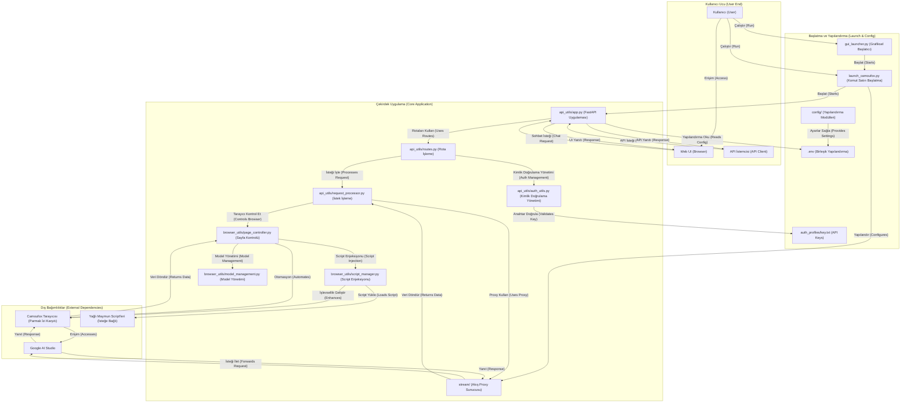

# AI Studio Proxy API

Bu, **Qwen Chat (chat.qwen.ai)** web arayüzünü OpenAI uyumlu API'ye dönüştüren Python tabanlı bir proxy sunucusudur. Camoufox (parmak izi algılamayı önleyen Firefox) ve Playwright otomasyonu ile stabil API erişimi sağlar.

[](https://www.star-history.com/#CJackHwang/AIstudioProxyAPI&Date)

This project is generously sponsored by ZMTO. Visit their website: [https://zmto.com/](https://zmto.com/)

Bu proje ZMTO'nun cömert sunucu sponsorluğuyla destekleniyor. Web sitelerini ziyaret edin: [https://zmto.com/](https://zmto.com/)

---

## Teşekkürler (Acknowledgements)

Bu projenin doğuşu ve gelişimi, aşağıdaki bireyler, organizasyonlar ve toplulukların cömert desteği ve akıllı katkıları olmadan mümkün değildi:

- **Proje başlatma ve ana geliştirme**: @CJackHwang ([https://github.com/CJackHwang](https://github.com/CJackHwang))
- **İşlevsellik iyileştirme, sayfa işlemi optimizasyonu fikir katkısı**: @ayuayue ([https://github.com/ayuayue](https://github.com/ayuayue))
- **Gerçek zamanlı akış özelliği optimizasyonu ve iyileştirme**: @luispater ([https://github.com/luispater](https://github.com/luispater))
- **3400+ satırlık ana dosya proje yeniden yapılandırma büyük katkısı**: @yattin (Holt) ([https://github.com/yattin](https://github.com/yattin))
- **Proje sonrası yüksek kaliteli bakım**: @Louie ([https://github.com/NikkeTryHard](https://github.com/NikkeTryHard))
- **Topluluk desteği ve ilham çarpışması**: Özellikle [Linux.do topluluğu](https://linux.do/) üyelerinin sıcak tartışmalarına, değerli önerilerine ve sorun geri bildirimlerine teşekkür ederiz, katılımınız projenin ilerlemesinin önemli gücüdür.

Aynı zamanda, sorun göndererek, öneriler sunarak, kullanım deneyimleri paylaşarak ve kod düzeltmeleri katkıda bulunarak bu projeye sessizce adanan her arkadaşa içtenlikle teşekkür ederiz. Ortak çabalarınız bu projeyi daha iyi hale getirdi!

---

**Bu, şu anda sürdürülen Python sürümüdür. Artık sürdürülmeyen Javascript sürümü için [`deprecated_javascript_version/README.md`](deprecated_javascript_version/README.md)'ye bakın.**

> ℹ️ 2025'ten itibaren, proje Alibaba Cloud Qwen Chat'e (https://chat.qwen.ai/) taşındı. Script otomatik olarak bu siteye bağlanacak ve Qwen3-Max, Qwen3-VL gibi resmi modelleri destekleyecek. Google AI Studio ile ilgili mantık kaldırıldı.

## Sistem Gereksinimleri

- **Python**: >=3.9, <4.0 (3.10+ önerilir en iyi performans için, Docker ortamında 3.10 kullanılır)
- **Bağımlılık yönetimi**: [Poetry](https://python-poetry.org/) (Modern Python bağımlılık yönetim aracı, geleneksel requirements.txt'yi değiştirir)
- **Tip kontrolü**: [Pyright](https://github.com/microsoft/pyright) (İsteğe bağlı, geliştirme sırasında tip kontrolü ve IDE desteği için)
- **İşletim sistemi**: Windows, macOS, Linux (Tamamen platformlar arası destek, Docker dağıtımı x86_64 ve ARM64'i destekler)
- **Bellek**: 2GB+ kullanılabilir bellek önerilir (Tarayıcı otomasyonu gerektirir)
- **Ağ**: Google AI Studio'ya erişim için stabil internet bağlantısı (Proxy yapılandırması desteklenir)

## Ana Özellikler

- **OpenAI uyumlu API**: `/v1/chat/completions` uç noktasını destekler, OpenAI istemcileri ve üçüncü taraf araçlarla tamamen uyumludur
- **Üç katmanlı akış yanıt mekanizması**: Akış proxy'si → Dış Helper hizmeti → Playwright sayfa etkileşimi çoklu garantisi entegrasyonu
- **Akıllı model değiştirme**: API isteğindeki `model` alanı aracılığıyla AI Studio'daki modelleri dinamik olarak değiştirir
- **Tam parametre kontrolü**: `temperature`, `max_output_tokens`, `top_p`, `stop`, `reasoning_effort` gibi tüm ana parametreleri destekler
- **Parmak izi algılama karşıtı**: Camoufox tarayıcısı kullanarak otomatikleştirilmiş script olarak algılanma riskini düşürür
- **Script enjeksiyon özelliği v3.0**: Playwright yerel ağ müdahalesini kullanır, yağlı maymun script'leri dinamik montajı destekler, %100 güvenilir 🆕
- **Modern Web UI**: Yerleşik test arayüzü, gerçek zamanlı sohbet, durum izleme, kademeli API anahtar yönetimi destekler
- **Grafiksel arayüz başlatıcısı**: Özellik zengin GUI başlatıcısı sağlar, yapılandırma ve süreç yönetimini basitleştirir
- **Esnek kimlik doğrulama sistemi**: İsteğe bağlı API anahtar kimlik doğrulaması destekler, OpenAI standart Bearer token formatıyla tamamen uyumludur; Qwen oturum açma akışı varsayılan olarak devre dışı, doğrudan ziyaretçi moduyla çalışır
- **Modüler mimari**: Net modül ayrımı tasarımı, api_utils/, browser_utils/, config/ gibi bağımsız modüller
- **Birleşik yapılandırma yönetimi**: `.env` dosyasına dayalı birleşik yapılandırma şekli, ortam değişkeni geçersiz kılma, Docker uyumlu destekler
- **Modern geliştirme araçları**: Poetry bağımlılık yönetimi + Pyright tip kontrolü, mükemmel geliştirme deneyimi sağlar

### Qwen Oturum Açma Desteği (İsteğe Bağlı)

Mevcut Qwen Chat ziyaretçi modu sağlar, herhangi bir tarayıcı kimlik doğrulama dosyası kaydetmeye veya yüklemeye gerek yok. Proje bu nedenle tüm oturum açma ile ilgili akışları varsayılan olarak devre dışı bıraktı (`ENABLE_QWEN_LOGIN_SUPPORT=false`). Eğer sonraki Qwen stratejisini değiştirir ve etkileşimli oturum açmayı yeniden etkinleştirmeye ihtiyaç olursa, sadece ortam değişkeninde `ENABLE_QWEN_LOGIN_SUPPORT` 'ı `true` olarak ayarlayın, ilgili GUI/CLI seçenekleri ve kimlik doğrulama dosyası yönetim işlevleri otomatik olarak geri yüklenir。

## Sistem Mimarisi



## Yapılandırma Yönetimi ⭐

**Yeni Özellik**: Proje şimdi `.env` dosyası aracılığıyla yapılandırma yönetimini destekliyor, sabit kodlanmış parametrelerden kaçınıyor！

### Hızlı Yapılandırma

```bash
# 1. Yapılandırma şablonunu kopyala
cp .env.example .env

# 2. Yapılandırma dosyasını düzenle
nano .env  # veya başka bir düzenleyici kullan

# 3. Hizmeti başlat (otomatik yapılandırma oku)
python gui_launcher.py
# veya doğrudan komut satırı başlat
python launch_camoufox.py --headless
```

### Ana Avantajlar

- ✅ **Sürüm güncellemesi endişesi yok**: Bir `git pull` ile güncelleme tamamlanır, yeniden yapılandırmaya gerek yok
- ✅ **Yapılandırma merkezi yönetimi**: Tüm yapılandırma öğeleri `.env` dosyasında birleştirildi
- ✅ **Başlatma komutları basitleştirildi**: Karmaşık komut satırı parametreleri olmadan, tek tıklama başlatma
- ✅ **Güvenlik**: `.env` dosyası `.gitignore` tarafından yoksayılır, yapılandırma sızmaz
- ✅ **Esneklik**: Farklı ortamların yapılandırma yönetimini destekler
- ✅ **Docker uyumlu**: Docker ve yerel ortam aynı yapılandırma şeklini kullanır

Ayrıntılı yapılandırma açıklaması için [Ortam Değişkeni Yapılandırma Kılavuzu](docs/environment-configuration.md)'na bakın.

## Kullanım Kılavuzu

[`gui_launcher.py`](gui_launcher.py) (grafiksel arayüz) veya doğrudan [`launch_camoufox.py`](launch_camoufox.py) (komut satırı) kullanarak günlük çalıştırma önerilir. Sadece ilk kurulum veya kimlik doğrulama süresi dolduğunda hata ayıklama modunu kullanın.

### Hızlı Başlangıç

Bu proje modern Python geliştirme araç zincirini kullanıyor, bağımlılık yönetimi için [Poetry](https://python-poetry.org/), tip kontrolü için [Pyright](https://github.com/microsoft/pyright).

#### 🚀 Tek Tıklama Kurulum Script'i (Önerilir)

```bash
# macOS/Linux kullanıcıları
curl -sSL https://raw.githubusercontent.com/CJackHwang/AIstudioProxyAPI/main/scripts/install.sh | bash

# Windows kullanıcıları (PowerShell)
iwr -useb https://raw.githubusercontent.com/CJackHwang/AIstudioProxyAPI/main/scripts/install.ps1 | iex
```

#### 📋 Manuel Kurulum Adımları

1.  **Poetry'yi Kur** (henüz kurulu değilse):

    ```bash
    # macOS/Linux
    curl -sSL https://install.python-poetry.org | python3 -

    # Windows (PowerShell)
    (Invoke-WebRequest -Uri https://install.python-poetry.org -UseBasicParsing).Content | py -

    # veya paket yöneticisi kullan
    # macOS: brew install poetry
    # Ubuntu/Debian: apt install python3-poetry
    ```

2.  **Projeyi Klonla**:

    ```bash
    git clone https://github.com/CJackHwang/AIstudioProxyAPI.git
    cd AIstudioProxyAPI
    ```

3.  **Bağımlılıkları Kur**:
     Poetry otomatik olarak sanal ortam oluşturur ve tüm bağımlılıkları kurar:

    ```bash
    poetry install
    ```

4.  **Sanal Ortamı Aktifleştir**:

    ```bash
    # Yöntem 1: Shell'i aktifleştir (günlük geliştirme için önerilir)
    poetry env activate

    # Yöntem 2: Doğrudan komut çalıştır (otomatikleştirilmiş script'ler için önerilir)
    poetry run python gui_launcher.py
    ```

#### 🔧 Sonraki Yapılandırma Adımları

5.  **Ortam Yapılandırması**: [Ortam Değişkeni Yapılandırma Kılavuzu](docs/environment-configuration.md)'na bakın - **Önce yapılandırma önerilir**
6.  **İlk Kimlik Doğrulama**: [Kimlik Doğrulama Ayar Kılavuzu](docs/authentication-setup.md)'na bakın
7.  **Günlük Çalıştırma**: [Günlük Çalıştırma Kılavuzu](docs/daily-usage.md)'na bakın
8.  **API Kullanımı**: [API Kullanım Kılavuzu](docs/api-usage.md)'na bakın
9.  **Web Arayüzü**: [Web UI Kullanım Kılavuzu](docs/webui-guide.md)'na bakın

#### 🛠️ Geliştirici Seçenekleri

Eğer geliştiriciyseniz, ayrıca şunları yapabilirsiniz：

```bash
# Geliştirme bağımlılıklarını kur (tip kontrolü, test araçları vb. içerir)
poetry install --with dev

# Tip kontrolünü etkinleştir (pyright kurulu olmalı)
npm install -g pyright
pyright

# Proje bağımlılık ağacını görüntüle
poetry show --tree

# Bağımlılıkları güncelle
poetry update
```

### 📚 Ayrıntılı Belgeler

#### 🚀 Hızlı Başlangıç

- [Kurulum Kılavuzu](docs/installation-guide.md) - Ayrıntılı kurulum adımları ve ortam yapılandırması
- [Ortam Değişkeni Yapılandırma Kılavuzu](docs/environment-configuration.md) - **.env dosyası yapılandırma yönetimi** ⭐
- [Kimlik Doğrulama Ayar Kılavuzu](docs/authentication-setup.md) - İlk çalıştırma ve kimlik doğrulama dosyası ayarları
- [Günlük Çalıştırma Kılavuzu](docs/daily-usage.md) - Günlük kullanım ve yapılandırma seçenekleri

#### 🔧 Özellik Kullanımı

- [API Kullanım Kılavuzu](docs/api-usage.md) - API uç noktaları ve istemci yapılandırması
- [Web UI Kullanım Kılavuzu](docs/webui-guide.md) - Web arayüzü özellik açıklaması
- [Script Enjeksiyon Kılavuzu](docs/script_injection_guide.md) - Yağlı maymun script'leri dinamik montaj özelliği kullanım kılavuzu (v3.0) 🆕

#### ⚙️ Gelişmiş Yapılandırma

- [Akış İşleme Modları Ayrıntıları](docs/streaming-modes.md) - Üç katman yanıt alma mekanizması ayrıntılı açıklaması 🆕
- [Gelişmiş Yapılandırma Kılavuzu](docs/advanced-configuration.md) - Gelişmiş özellikler ve yapılandırma seçenekleri
- [Günlük Kontrol Kılavuzu](docs/logging-control.md) - Günlük sistemi yapılandırması ve hata ayıklama
- [Sorun Giderme Kılavuzu](docs/troubleshooting.md) - Yaygın sorun çözümleri

#### 🛠️ Geliştirme İlgili

- [Proje Mimarisi Kılavuzu](docs/architecture-guide.md) - Modüler mimari tasarım ve bileşen ayrıntıları 🆕
- [Geliştirici Kılavuzu](docs/development-guide.md) - Poetry, Pyright ve geliştirme iş akışı
- [Bağımlılık Sürüm Açıklaması](docs/dependency-versions.md) - Poetry bağımlılık yönetimi ve